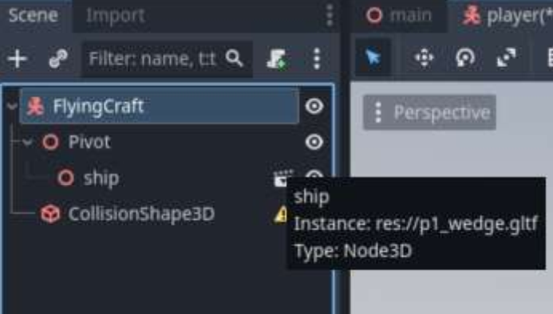
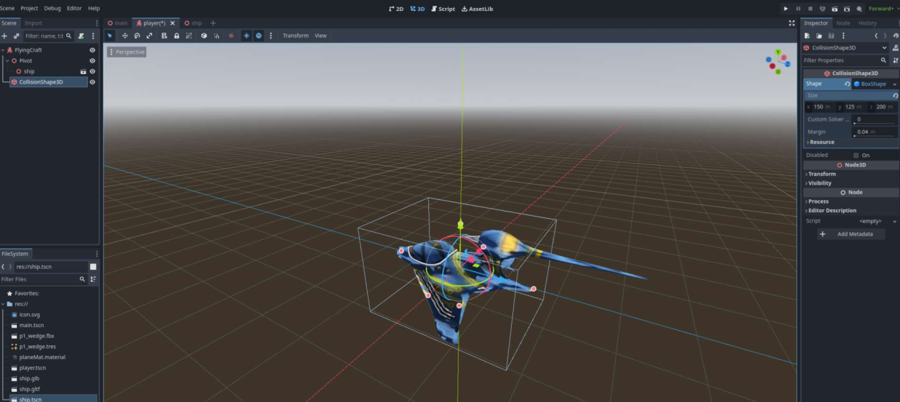
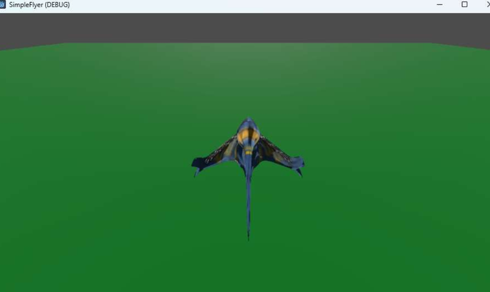

# Lab Assignment #4
## Due Monday, February 9 @ 11:59pm
In this assignment you will practice 3D game development, leveraging what we we learned in 2D, as well as some work on 3D transforms.

## Preliminary Steps
You will follow the steps below to first create a base system. We will then make some changes to it, based on the items listed in the Requirements section.

### 1. Setting up game and player scene
- Similar to the [Lab 0 tutorial](https://github.com/CS-2053-2026/Labs/blob/main/Lab-0/lab-0.md), add a new StaticBody3D plane called “Ground” to your main node. Change Ground to a desirable size (change the mesh size instead of scaling because this can lead to unpredicatble behaviour). Note: your CollisionShape3D and MeshInstance3D should be the same size. You can right click on the "size" lable and copy the one set of dimensions and paste them to the other object.

Change the ground colour to something appropriate (review [Lab 1](https://github.com/CS-2053-2026/Labs/blob/main/Lab-1/lab-1.md) for Materials).

- Make a new scene for the Player. Review Lab 0, note the need for a collision shape and a Pivot node. A model ship has been given to you in the lab materials, but it has to be imported by dragging it into Godot. (ship.gltf) GLTF files are a non-proprietary 3D file format. Godot can handle common proprietary ones like FBX files, but importer software is needed (Godot will prompt you to install and provide instructions if you do so for your Project). 
- Drag the imported ship.gltf file onto the Pivot to create it as a child scene.
- Rename the scene to “FlyingCraft”.
- Open the model by clicking on the media icon on the node. Godot will give you two options, instantiate it as a new inherited scene.



- We now are allowed to view the internals of the mesh file, but we cannot change much (we'd have to use a 3D model editor like Blender for that). However, we can override certain qualities. 
- First, rename nodes and save the scene  as "ShipModel"
- Scale the root node transform to be 5% of it's normal size.
- Click on the *_geo subnode which is a MeshInstance3D. Click on the Mesh to open it and in the Surface Material Override tab's container 0, drag the ship_diffuse.tga. The ship should now have the texture applied. Save as a scene named "ShipModel" and inspect your FlyingCraft scene.
- Note your FlyingCraft scene likely doesn't have the texture applied. This sometimes happens with 3D models imported into godot. Let's delete the node created when we dragged the GLTF into the scene and instead import the ShipModel scene we just made. 
- You should now see the ship at a good size. 
- Next add an appropriate CollisionShape3D for the FlyingCraft (we used a Box, but you can use multiple colliders and different shapes to get the best match to the FlyingCraft model; again remember to change the CollisionShape's size rather than scale).




### 2. Rotate 3D Model Around the Y-Axis
- Create a new script for “FlyingCraft” with name “flying_craft_controller.gd”.
- Add the following instance variables:

```gdscript
var rotationAngleRadian : float
var rotationSpeedRadian : float
var rotationDirection : float
```

- In the _ready() function, add the following code:

```gdscript
	rotationAngleRadian = 0
	rotationSpeedRadian = 1
	rotationDirection = 0
```

- Define a new ```rotate_ship()``` method as follows. Carefully read the code to understand the code. 

```gdscript
func rotate_ship(delta):
	var rotationVelocityRadian = rotationSpeedRadian * rotationDirection
	
	rotationAngleRadian += rotationVelocityRadian * delta

	transform = transform.rotated_local(Vector3.UP, rotationVelocityRadian * delta) 
	#Vector.up is Y-Axis
```
- Go back to your main scene. Add the FlyingCraft in, and attach a Camera3D as a child of the player (why as a child?). Move the camera manually to be behind the FlyingCraft, looking at it, at and appropriate distance and angle. Resize and move the ground so that it is below the FlyingCraft and much larger than it (like... the ground).

- Run the program. Press “left arrow” key or “right arrow” key to observe how the 3D model rotates around Y-Axis. We don't have any light in here, so it may be tough to tell; we'll fix that shortly. Change the value of rotationSpeedRadian to make rotation slower or faster.

## Add a light
- In your main scene, add a DirectionalLight3D node. Rotate and position it so it brightens up your scene nicely. Try running the game again with the light. You may need to increase the light's Energy in the inspector


### 3. Move the 3D model forward and backward
Now you will move the 3D model forwards and backwards along the orientation/direction of the model in parallel with X-Z plane.

- Add the following instance variables to FlyingCraftController script

- Add the following instance variables to FlyingCraftController script

```gdscript
 var motionVelocity : Vector3
 var motionSpeedXZ : float   
 var motionDirectionXZ : int
```

- In _ready() method, add the following code:

```gdscript
motionVelocity = Vector3.ZERO
motionSpeedXZ = 50
motionDirectionXZ = 0
```
 
- Define a new “move()” function with the following code. Carefully read the code to understand the code.

```gdscript
func move(delta):
	var motionX = sin(rotationAngleRadian) * motionDirectionXZ
	var motionZ = cos(rotationAngleRadian) * motionDirectionXZ

	motionVelocity = Vector3(motionX, 0, motionZ)

	#normalized vector to represent the directions of motionVelocity
	motionVelocity.normalized()

	motionVelocity = Vector3(motionVelocity.x * motionSpeedXZ, 0, motionVelocity.z * motionSpeedXZ)
	transform = transform.translated(motionVelocity * delta)

	rotationDirection = 0
	motionDirectionXZ = 0
```

- In ```_process()``` method, add the code to control motion of FlyingCraft object going forward to backward in the object’s current orientation/direction by keyboard “up arrow” or “down arrow” keys.

- Run the program. Press “up arrow” or “down arrow” keys to observe motion of the 3D object. Change the value of motionSpeedXZ variable to make the object move slower or faster. Note that in case that the motion does not align with the object’s direction, in FlyingCraft’s inspector, change Y value of Transform/Rotation, to pre-rotate the object around Y-Axis in desired radiana, and/or change the project axis, i.e.  switch Math.Sin() and Math.Cos() for X and Z.


### 3. Move 3D model up and down in Y-axis

- Add the following instance variables in FlyingCraftController script

```gdscript
var motionSpeedY : float
var motionDirectionY : int
```

- In “_ready(), add the following code. Note that you can set different speed for Y-Axis motion that X-Z motion.

```gdscript
motionSpeedY = 50
motionDirectionY = 0
```

- In move() method, modify your code to use motionSpeedY and motionDirectionY to be able to move vertically. Note that we are not rotating it vertically (pitch), we are just translating it

- In process() method, add the following code control motion of the FlyingCraft object in Y-Axis by keyboard keys ‘u’ (up) and ‘j’ (down).

- Run the program. Press ‘u’ key or ‘j’ key to observe how the FlyingCraft object moves in Y-Axis. Change the value of motionSpeedY to make the object move slower or faster along Y-Axis.


## Requirements
Based on the tutorial above you will now update your game to meet the following requirements. 

- Update the spaceship so that it always flies forwards at a constant speed.
- Update the ship's controller, so that the up and down arrows allow you fly up higher or lower.
   + No forward or backwards controls are needed.
- You will create a 3D obstacle scene that the player can fly through.
   + For example, using cubes create a structure that the player can fly through
- You will create at least 3 obstacles placed over the "ground" that the players must fly through, without touching the sides of the obstacle.
   + The three obstacles should be distributed in a challenging way and have different rotations
- To win the game players must fly through all three obstacles.
   + Note flying through the same obstacle 3 times, should not work.
- The number of obstacles remaining is displayed in the top right-hand corner of the screen.
- If the player hits the ground or makes contact with any of the obstacles sides, the ship stops moving and responding to input, and "you lose" message is displayed.
- If the player wins, the ship stops moving and a "you win" messages is displayed.
- The game can be restarted at any time using the 'r' key.

## Specific Steps to Help

### 1. Create an Obstacle
- Use 4 separate cubes to create an obstacle.
   + Scale and stretch them as appropriate.
   + For each cube, "ColliderShape3D" node with a box collider.
- In the interior (the gap) of your obstacle create and Area3D node. Make the Area3d a cube that will fill up the entire empty space.
   + keep this area transparent by not giving it a texture or mesh
- tag the cubes in the scene with an appropriate tags (e.g., gap, obstacles, etc). 
- catch the signal for a player entering the gap
- check for collisions with the obstacle sides

### 3. Add in Tags to the Different Game Elements
Adding tags to each obstacle type allows our ship to know what it collided with, so it can react accordingly. The alternative approach would be to add collisions processing functions on each of the objects that can be collided with (you can hopefully see why using tags is a better approach).

- For each of the elements (ground, each part of the obstacle, and the gap) add in the appropriate tags, and double check it has a collision shape sized appropriately
- Note for the Ground, you will first have to Check "Convex" before you can check "Trigger"


### 4. Test your game extensively!!!

### 5. Finish it all off
- Most of the remaining code will be added to the main scene somewhere
- Add in Text elements (see Lab Assignment #1) for the obstacles remaining display and to display a message when the game ends.
- Remember to add in an 'r' to restart the game.
- Make sure that you meet all other game requirements!
- Test and submit!

## Submitting
Remember to commit and push your code to GitHub. Don't forget to check the website to see that it worked. 	
