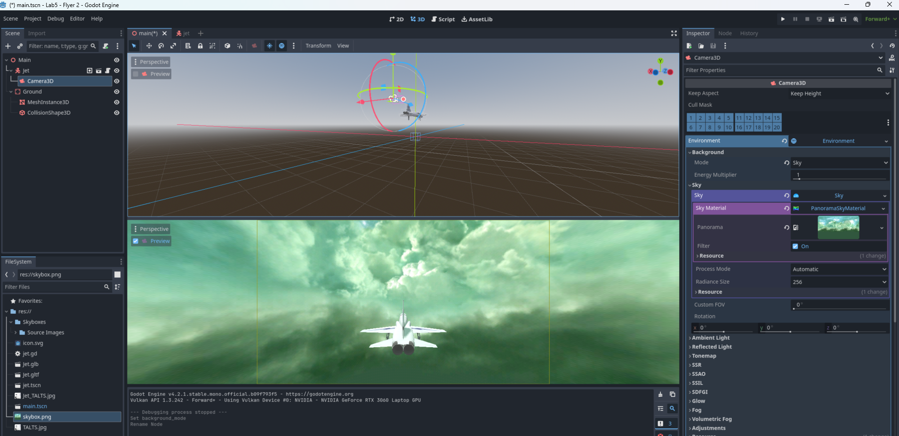
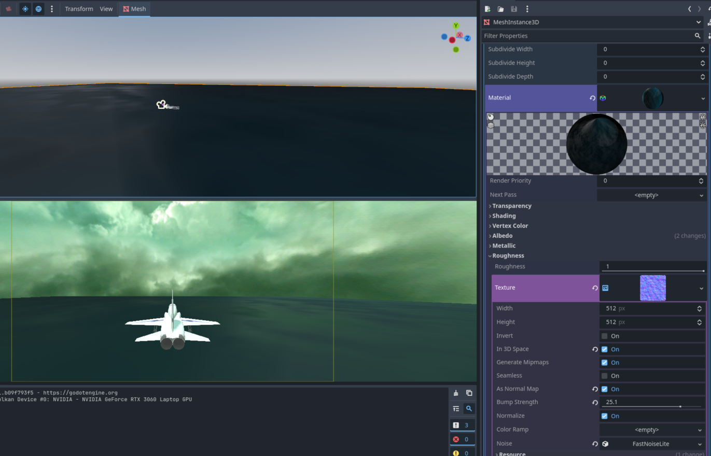
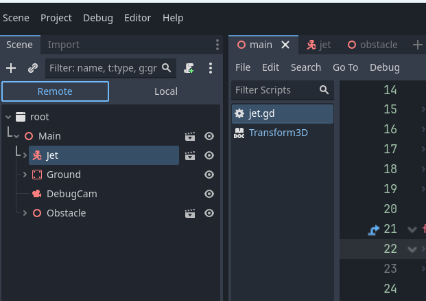

# Lab Assignment #5: Rotation and Lights 

In this lab assignment, you will gain experience with game object rotation in multiple axes, as well as using different light types.

## Due Feb 16th @ 11:59pm

## Background
Review the following materials (just for the specified parts of the larger document) before you get started:

 - Review 3D transforms, model vs world transforms, 2D linear algebra basics, and lights 

## 1. Preliminary Steps

 1. Import all files from this lab's resource directory.
 2. Once imported, create a scene for the jet - create a CharacterBody3D and drag the JET 3D model to the node, give it a name and add it to a Group. Rotate the jet around the y-axis by 90 degrees.
 2. Add collision boxes to your jet. This time, try to use multiple collision boxes to better fit the craft (you might use 3 BoxShapes, but up to you). If you copy/duplicate nodes, remember to make new BoxShape for the CollisionShape (dropdown menu -> new BoxShape), or else changes to the BoxShape in one CollisionShape will affect the other CollisionShape that shares the same BoxShape.  
 3. You can also create an Area3D that makes of a copy of all the collision boxes from the previous step. This will give you an easy collision solution hack we'll use later.
 4. In the main scene, add the Jet and a Camera. Set the camera to be a child of the aircraft, and position it appropriately so it follows the aircraft. 
 5. In Camera, find the Environment property, create a new Environment. 
 6. In the options, change the background mode to Sky, and in Sky create a new Sky.
 7. Inside the Sky tab, create a new Sky, open _that_, for Sky Material create a PanoramaSkyMaterial, and inside that drag the skybox.png onto Panorama.
	- You will not see it until you look through the camera, so either run the scene to test, or open a camera view with preview turned on (also from lab 0, 1). Note how many things you can do with the sky, the environment, etc. You should explore some of the options.
 
 9. Create a ground, like before, and make it 100 units wide. This time, try experimenting with more material settings here to make something like an ocean - for example, we added a NoiseTexture2D, played with settings, and added the noise with FastNoiseLite in the Noise property. Just explore with this part, a simple ground is also fine:
 
 10. Create a new script for the Jet, and copy and paste the following code. Carefully read and understand the code.
 
```gdscript
var circleRadius : float
var circleSpeed : float
var circleAngle : float #radians
var selfRotationSpeed : float
var lastDirection : Vector3

func _ready():
	circleRadius = 40
	circleSpeed = .5
	circleAngle = 0
	selfRotationSpeed = -0.5

	lastDirection = Vector3(1, 0, 0)
	lastDirection.normalized()

func _physics_process(delta):
	circleAngle += circleSpeed * delta

	circleAngle = fmod(circleAngle , 2*PI)
	
	var newPositionX = circleRadius * cos(circleAngle)
	var newPositionZ = circleRadius * sin(circleAngle)

	var newPosition = Vector3(newPositionX, position.y, newPositionZ)
	var newDirection = newPosition - position

	newDirection.normalized()

	var rotationAngle = -1*lastDirection.angle_to(newDirection)
	transform = transform.rotated(Vector3.UP, rotationAngle)
	transform = transform.rotated_local(Vector3.FORWARD, selfRotationSpeed * delta)

	position = newPosition
	lastDirection = newDirection
```
 - Run the program and observe how the Aircraft object moves along a circular path. It rotates in world space as it moves around the circle, and rotates around its own forward axis (model space). If you are unsure, you may want to create another camera "Debug Camera" to give you a bird's eye view and see the scene, or try commenting out the rotations and observing them independently.
 	- You can have multiple cameras. But only one can be "current" at a single time. In the Inspector for each Camera you will find a "current" checkbox. The last camear to be marked as current will be the one that is used. 


## 2. Requirements

 - Make the following changes to the program to make the Aircraft object go around the circular path and self-rotate controlled by the keyboard keys:
    + Pressing the “up” key, the Aircraft will go forward along the circular path (no backwards motion)
    + Pressing the “left” or “right” keys, the object will roll left or right.
    + Be sure to test your program after each change. 
    + Hint: Only one line of the code is responsible for rolling the aircraft, the other lines are for moving forward around the circle.
    + Hint: Once you do this change you may find your aircraft does not start on the circular path, but rather at (0,0,0). Why? To get your aircraft in a valid position on it's path you may need to run the code for positioning it twice.
    + Hint: Your aircraft may not be travelling forward. This doesn't mean it is moving along the wrong path - you may just need to rotate the model in the editor!

 - Add 3 obstacles on your aircraft's path, like Lab4
     + Each obstacle should require your airplane to rotate differently.
     + Hint: A trick to find good positions for your obstacles is to do the following: 
       - run your game, get the aircraft on the circular path and then pause your game, at a position and rotation you would like for your obstacle.
       - while the game is running, go to the scene hierarcy, and above it, select "remote" - this now shows the scene that is running live
       
       - Go to your aircraft and copy its transform values (In the Inspector, right click the position and  "Copy values"). 
       - Switch back to "local" in the scene tab. Go to your Obstacle's Transform position and paste in the values (click the gear on Transform and "Paste Values")
       - when you do this, make sure that the inspector tab properly updates when you click the local scene - it keeps the old selected node selected, so clicking on it again may not refresh the Inspector tab. Typically, I clicked on another node first, then the one I wanted to paste the values to.
       - Perform the same for rotation
       - Now your Obstacle will start in this position (it should have live updated in the game). 
    
 - Add in collision handling.
     + When a collision happens (because the aircraft is not oriented properly to fit through the gap of the obstacle) the Aircraft should not be able to fly forward, however, it should be able to rotate. 
 - There will be countdown time for going around the whole circle path. If the player takes more than the time limit, the player loses the game.
 - You can let the play go several rounds. Make each later round have shorter time limit to make it more difficult. Count how many obstacles the ship passes as a score
 - In addition to the above game play, you need to add and allow control over the following lighting options during game playing.
     + Pressing the “a” key to toggle the colors of the ambient light between red and black.
         * note that Ambient Light is a property of the Camera3D. You can create a Color object to assign the ambient object.
         * you should set your Source to Color for this to be obvious, but you can play around to make it look nicer if you'd like.

     + Add in a Directional light. Pressing the “d” key will toggle the directional light on or off. (enable/disable component with Node.process property)
         * You may optionally change the settings and position of your directional light.
         
     + Create a new point light (OmniLight3D in godot) that has a green color. Pressing the “p” key to toggle it on or off.
         * Make sure the point light can reach 50% of game scene. 
         
     + Create a spot light with a blue color. Put it in the center of the game scene. Make the light rotate to always cover the moving aircraft object. Press "s" key to toggle the light on or off. All Node3D's have a look_at() function that will be useful here.
     
     + Hint: For all of the above lights, you may need to adjust the parameters to make sure that they work appropriately. Remember to check the Scene view while your game is running to see the location and behaviour of your lights.   

 - Finish it all off
     + Add in Text elements (see Lab Assignment #1) for the time remaining display and to display a message when the game ends.
     + Make sure that you meet all other game requirements!
     + Test, commit and push!

## Test and Submit
### Build and Test on Your Platform
 - Remember to save your scene, and test thoroughly.
 - Remember to commit and push your solution, and verify that it is on the Github website.

### Credits
This lab uses: 
 - an uncredited open source model for a plane, 
 - a 3D cubemap for a skybox by [https://opengameart.org/users/arikel](https://opengameart.org/users/arikel), 
 - and an open source tool to turn cubemaps into equirectangular panoramas here: [https://danilw.github.io/GLSL-howto/cubemap_to_panorama_js/cubemap_to_panorama.html](https://danilw.github.io/GLSL-howto/cubemap_to_panorama_js/cubemap_to_panorama.html).
