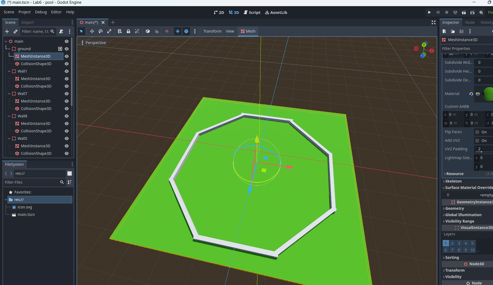
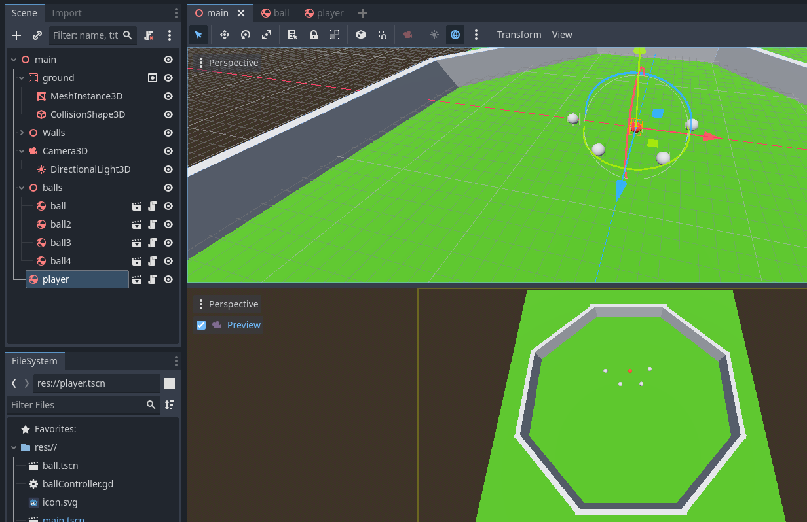
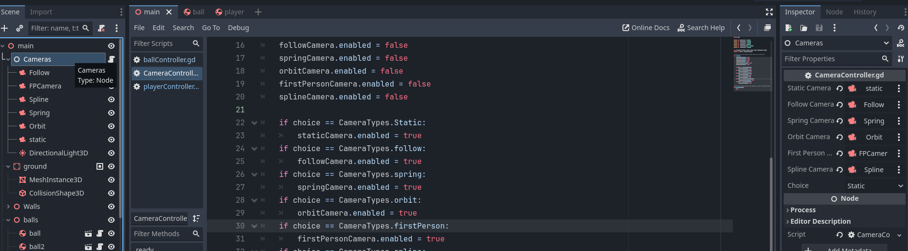
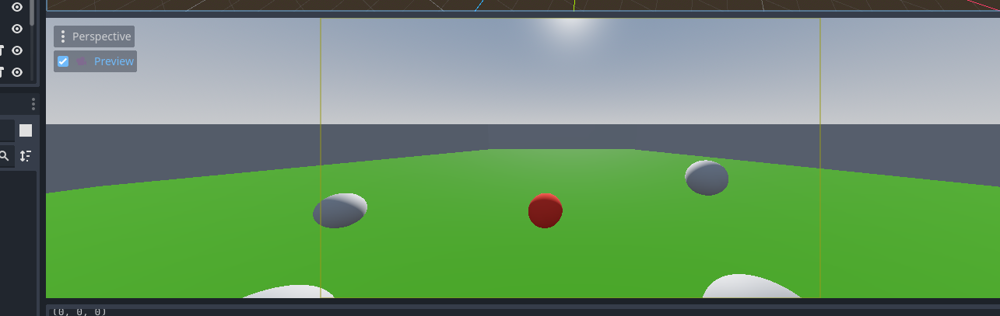
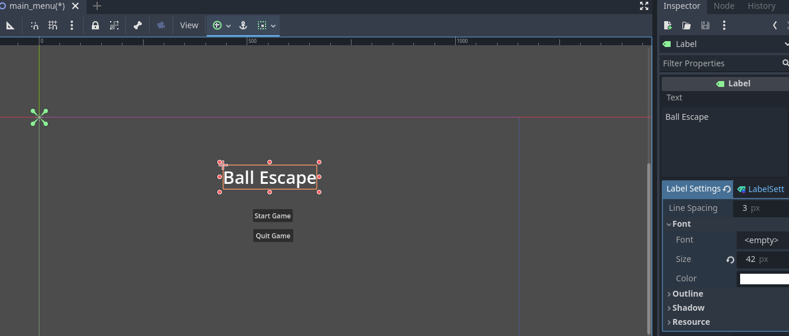
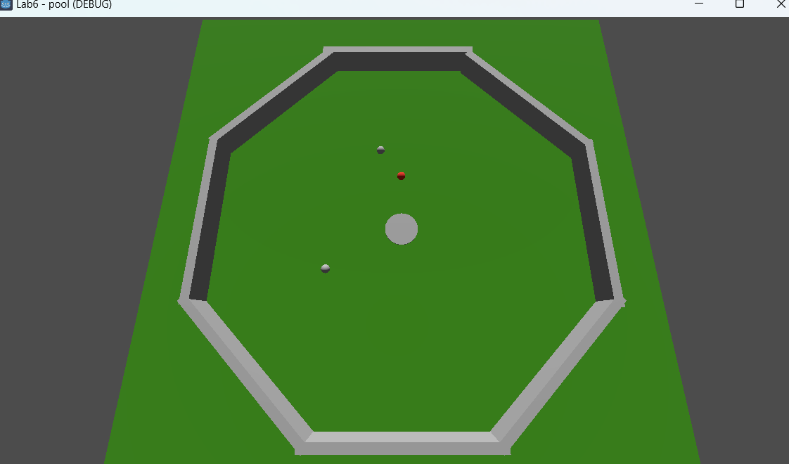
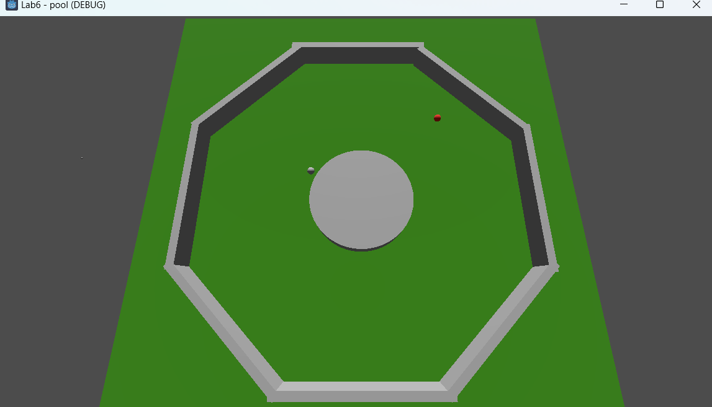

# 2053 Lab Assignment #6: Physics, Cameras, and Scenes

In this final lab assignment, you will gain experience with a 3D game, physics, cameras, and working with multiple scenes.

This has been designed to walk you through the steps. This assignment will be made easier if you follow them closely, step by step.

## Due: 11:59pm, March 23

## 1. Setup the Basic Game

 1. Instead of Area3Ds, in this lab we will be using RigidBody3D and StaticBody3D nodes as the basis for objects that move and don't move respectively.
 2. Create a StaticBody3D and name it "ground". 
 3. Attach a CollisionShape3D to the ground, and create a new [WorldBoundaryShape3d](https://docs.godotengine.org/en/stable/classes/class_worldboundaryshape3d.html) as the shape for the CollisionShape3D. Note that the WorldBoudaryShape is an infinite plane (see the documentation). 
 4. Add a MeshInstance3D to the ground and size it as you would normally (go for 100x100m; i.e., do not use the scale, set its size). 
  - Create a material for your ground, change its color, and drag it from your assets folder to the ground plane in your scene view. You might later want to repeat this for the walls and balls, if you like.
 3. Add a default camera and directional light to see the scene.
 2. Add a new 3D node, and rename it "walls". This will be used to organize each of the walls you add to your game.
 3. As a child of walls, a series of 3D cubes (i.e., StaticBody3Ds with collision shapes and meshes) to build a closed polygon, preferably more complex than rectangle or square, such as an octagon. In other words, make a shaped play area with short walls. 
  - After adding the first wall, consider making it its own scene for easier changes to all walls in the future. `right click scene and choose 'Save branch as scene'`
  - Lay the cubes (that have been stretched to make walls) on X-Z plane. Make sure they have meshes and collision shapes. You should make them a bit higher than 1 meter but not so tall they're hard to see over, e.g., 5 meters.  .
 5. Create a new scene with the name Ball.  For the ball scene, make sure it is a RigidBody node - a physics body that reacts to physics. Note the “Mass” property. Add a spherical collider and mesh. Add it to your main scene.
    - you should adjust the walls for your shape so that the "Ball" is approximately in the center of the enclosed area. 
 7. In the ball's rigid body properties, turn on Contact Monitoring in Solver, and increase Max Contacts to a larger number (i.e., how many objects the object can collide with at once).
    - Turning on
Contact Monitoring in a RigidBody3D enables the body to "listen" for collisions and emit signals when they occur. 
    - By default, Godot's physics engine calculates the physical response (like bouncing or sliding) but does not track which specific objects were hit to save on memory and performance. Enabling this property is the first step to making your RigidBody3D interactive through code. 
 8. Create a new script with name “ball_controller” for the Ball object. Add the following code to the new script. You should be able to read it and understand it. For the functions your don't know, look them up in the internal godot doc.

    ```gdscript
		extends RigidBody3D
		
		func _ready():
			var forceDirection = Vector3(randf_range(-1, 1), 0, randf_range(-1, 1))
			forceDirection = forceDirection.normalized()
		
			var forcePower = 5000
			var initForce = forcePower * forceDirection
		
			#initial push onto the ball in the forceDirection with forcePower
			apply_force(initForce)
		
		func _physics_process(delta):
			var collidingBodies = get_colliding_bodies()
			for body in collidingBodies:
				#note that your ground object must be named exactly ground
				if not body.name.contains("ground"):
					print("sphere collided with %s" % body.name)

    ```
    
 9. Run the program. Observe that the ball object’s movement by the initial force and (limited) bounces from the collided cubes. Note the collision could be detected on either side of the collision (a script on the boxes could detect the same collisions). If your ball ramped out of the game area, increase the height of your walls (and double check all colliders).

 4. Create a “PhysicsMaterial” named “WallMat" in resources folder. Notice the configurable properties of the material.  Drag it to the Physics Material entry of the StaticBody component of each wall.
 6. Add this material to the ball as well, or make a new one so that you can change the ball and wall physics properties independently.
 10. Change the friction and bounciness property values in “BounceMaterial” to see how the ball’s movement changes. Also change the “Mass” property of the ball’s “Rigidbody” to see how the ball’s movement changes. The more mass the more force needed to accelerate it. Note that if the ball moves quickly, it may pass through a wall...you can try out Godot's "continuous integration" feature (similar to that described in class) in the Solver options for the RigidBody.
 11.  Duplicate the Ball object to create several more ball objects and set there intial place to be at a differen location inside the polygon on the ground. Run the program and observe collisions between balls which are detected by two colliding balls’ Sphere Colliders. Do any of them go flying out of the game?
    - To stop balls from flying off, you can lock them, so their transform y-values cannot change. In the ball, RigidBody object, in the inspector, find the `AxisLock` section, and lock the Linear Y Axis.

 3.  Duplicate your ball scene (right click ball.tscn) to create another spherical RigidBody scene (also with mesh and colliders), but this time call it "Player".
 4.  Provide a group for your "Player" called "Player", and and create a distinct color using a material for the player.
 
 5.  Create a "player_controller" script for the player and provide it with the following code, placing it in the appropriate function. You will need to set an appropriate speed. And you may need to adjust the script or your project so that it works.
 
    ```gdscript
    var forceDirection = Vector3(0,0,0)
	if Input.is_action_pressed("up"):
		forceDirection.z-=1
	if Input.is_action_pressed("down"):
		forceDirection.z+=1	
	if Input.is_action_pressed("right"):
		forceDirection.x+=1	
	if Input.is_action_pressed("left"):
		forceDirection.x-=1	

	#initial push onto the ball in the forceDirection with forcePower
	apply_impulse(forceDirection*speed)
    ```
 19. You may at this point want to create sub folders in your Assets folder to help you organize your Assets. You can also use Node3D parents to organize my objects e.g., Balls together into one group

## 3. Add Cameras to your Game Scene

### 3.1 Static Camera and Camera Controller

 20. Rename your initial camera to “StaticCamera”. Create 4 more cameras with names “FollowCamera”, “SpringCamera”, “OrbitCamera”, and “FirstPersonCamera”.
 21. Change the following properties of the static camera: 
    - Set its transform (position and rotation) to be able to view the entire scene (a top-down view would be an easy way to achieve this).
 3. Create an empty Node3D with name “Cameras”, and create “camera_controller” script. Group all cameras into the "Cameras" Node, and added a script there with the following code:

    ```gdscript
	@export var staticCamera : Camera3D
	@export var  followCamera : Camera3D
	@export var  springCamera : Camera3D
	@export var  orbitCamera : Camera3D
	@export var  firstPersonCamera : Camera3D
		
	enum CameraTypes {Static, follow, spring, orbit, firstPerson}
	@export var choice = CameraTypes.Static

	# Called when the node enters the scene tree for the first time.
	func _ready():
		staticCamera.current = false
		followCamera.current = false
		springCamera.current = false
		orbitCamera.current = false
		firstPersonCamera.current = false
	
	
		if choice == CameraTypes.Static: 
			staticCamera.make_current()
		if choice == CameraTypes.follow:
			followCamera.make_current()
		if choice == CameraTypes.spring:
			springCamera.make_current()
		if choice == CameraTypes.orbit:
			orbitCamera.make_current()
		if choice == CameraTypes.firstPerson:
			firstPersonCamera.make_current()
	

    ```
 4. In the main scene, drag all the camera nodes onto the above script's exported camera variables appropriately. 
 

 5. In Inspector of the CameraController, enter “static” in “choice” entry of the “Camera Controller”, then run the program and move the player object around to retest how static camera works.

### 3.2 Update the Follow Camera
 6. For “Follow Camera” object, create `follow_camera_controller` script with the following code. Read it, and understand how it works. If you are confused, review your transforms.

  ```gdscript  
	@export var target : Node3D
	
	var offset : Vector3
	
	func _ready():
	    offset = position - target.position;
	
	
	func _process(delta):
	    position = target.position + offset;

  ```

 7. In the Inspector, play around with the Follow Camera’s transform so that it provides a 3rd person view. Pick an appropriate "above and behind the shoulder view". Remember from Lab1 you can open a preview of a camera (you will need to check the "Current" variable in the camera's inspector and maybe refresh your preview window)
 
 8. Drag the Player object to the “Target” entry of “Follow Camera”, set “Speed” entry of the player object to some positive value, and enter “follow” in the “Choice” entry of Camera Controller.
 9. Run the program. Move the player object and observe how the follow camera following the player object with fixed distance.

### 3.3 Update the Spring Camera

 10. For “Spring Camera” object, create “spring_camera_controller” script with the following code:

    ```gdscript
	@export var target : Node3D
	var springConstant = 9.0
	var dampConstant
	
	var offset
	var actualPosition
	var velocity
	
	func _ready():
		dampConstant = 2.0 * sqrt(springConstant)
		offset = position - target.position
		actualPosition = position
		velocity = Vector3.ZERO
	
	func _process(delta):
		var idealPosition = target.position + offset
		var displacement = actualPosition - idealPosition
		var springAccel = (-springConstant * displacement) - (dampConstant * velocity)
		velocity += springAccel * delta
		actualPosition += velocity * delta
		position = actualPosition

    ```

11. Return to the Inspector of the Follow Camera, and like we did in an earlier lab, copy the transform of the follow camera to the spring camera.
12. Drag player object to the “Target” entry of “Spring Camera”, set “Speed” entry of the player object to some positive value, and enter “spring” in the “Choice” entry of Camera Controller.
13. Run the program. Move the payer object and observe how the spring follow camera following the player object with variable distances. Play with the spring constant for a good feel.

### 3.4 Update the Orbit Camera
12. For “Orbit Camera” object, create “orbit_camera_controller” script with the following code:

    ```gdscript
	@export var target : Node3D
	var speed = PI/8
	var offset
	var angle = 0
	
	func _ready():
		offset = position - target.position;
	
	func _process(delta):
		angle += speed * delta
		position = offset.rotated(Vector3.UP, angle) + target.position
		angle = fmod(angle, 2 * PI)
		look_at(target.position, Vector3.UP)
    ```
    
	You should be able to understand this code. If not, refer to transforms and vector math.

13. Copy and paste the transform from either the Follow or Spring camera.
14. Drag player object to the “Target” entry of “Orbit Camera”, set “Speed” entry of Orbit Camera to some positive value, and enter “orbit” in the “Choice” entry of Camera Controller.
15. Run the program. Observe how the orbit camera orbits around the player object with fixed distance.

### 3.5 Update the First-Person Camera

16. For “First Person Camera” object, create “first_person_camera_controller” script and copy the same code from “FollowCameraController”.
17. Set the First Person Camera’s transform as position(0,1,0) and rotation as appropriate (probably 0 rotation).
18. Drag player object to the “Target” entry of “First Person Camera”, set “Speed” entry of the player object to some positive value, and enter “first person” in the “Choice” entry of Camera Controller.
19. Run the program. Move the player object and observe how the first person camera has the same view as the player object. For a challenge, try making the camera only follow rotations on the Y-axis (not spinning with the ball, but only when the user wants to turn with the left/right buttons)

### 3.6 Finishing Up
20. Modify your input map and camera controller so that pushing number keys will swap to the corresponding camera:
    1. Static camera
    2. Follow camera
    3. Spring camera
    4. Orbit camera
    5. First-person camera


## 4. Create a Menu Screen/Scene

1. Create a new 2D Scene, and name your scene "MainMenu"
2. Add two buttons to your scene (Add node -> Button). Position your buttons, so that they are centered in the window.
3. Change the name of the first button to "StartButton" and set its text to "Start Game".
4. Change the name of the second button to "QuitButton" and set its text to "Quit Game".
5. Create a Label node and name it "Title" and add it to your scene. Make the text large and visible by adding a new LabelSettings component in the inspector and adjusting font size, and give your game a name, e.g., "Ball Escape".

6. Add a script to your main menu base node called "GameController.gd"
7. Connect the "pressed" signals for your start and quit buttons. Use the below code to create the appropriate button response

	```gdscript
	extends Node2D
	class_name Game
	enum GAMESTATES {begin, plaing, win, lose}
	
	static var GAME_STATE = GAMESTATES.begin
	
	func _ready():
		if GAME_STATE == GAMESTATES.begin:
			$Title.text = "Ball Escape"
		elif GAME_STATE == GAMESTATES.win:
			$Title.text = "You Win!!!"
		elif GAME_STATE == GAMESTATES.lose:
			$Title.text = "You Lose!!!"
			
	#for starting
	func _on_button_pressed():
		get_tree().change_scene_to_file("res://main.tscn")
	
	#for quitting
	func _on_quit_pressed():
		get_tree().quit()
	```
7. Look at the code above carefully. Note that the enumeration can be referenced in any scene or object as a type as long as the scene is not unloaded() by referencing the class_name. E.g., Game.GAMESTATES.begin is accessible anywhere. For this access to be possible, you must declare a "class_name" at the first line (after extends) of the file.
8. Note the ```GAME_STATE``` variable is static (not an instance variable). Since only one copy of this variable exists for the whole main menu class, this can be used to track and update the state of your game from scripts anywhere in your game:

```cs
if ballCount == 0:
	Game.GAME_STATE = Game.GAMESTATES.win
    #here, add code to load your menu back
```
 
## 5. Complete the Game
Once you have completed all of the steps above you are ready to complete the game with the following aspects:

 - Winning the game will mean using your player ball to knock all other balls into the exit hole.
    + Upon winning the title screen is displayed with a "You Win!" message.
 - Losing the game happens if the player ball enters the hole
    + Upon losing the title screen is displayed with a "You Lose!" message.
 - Add an exit hole to the game. A ball should have to pass directly over the hole to count. Non-player balls will disappear, and the player ball will immediately trigger the end of the game.
    + Hint: a cylinder can be used as a hole. However, you may need a second (smaller and invisible) cylinder to get the correct collision behaviour with your code.
    + You may do this lab with either Area3D's or StaticBody3D's. Remember that they use different events, and are handled in different ways. Review Lab 4, 5 and the end of the Physics lecture for notes on the differences between collisions with Areas and PhysicsBodies.

 - Add keys into the game that will cause the cylinder for the hole to either be larger or small (this is to make it easy for your grader to test your game)
    + By default and when the game starts the hole should be smaller (challenging to hit, but not impossible)
    + Pushing *9* Should cause the hole to grow to be 2 times as large and can be pressed repeatedly (this should be the collider, and does not necessarily have to be the visual hole itself)
    + Pushing *0* should cause the hole to return to its original, smaller size.
A regular-ish size:


after enlarging a few times:


### 6. Submitting
 - Test your code, remember to push and commit.