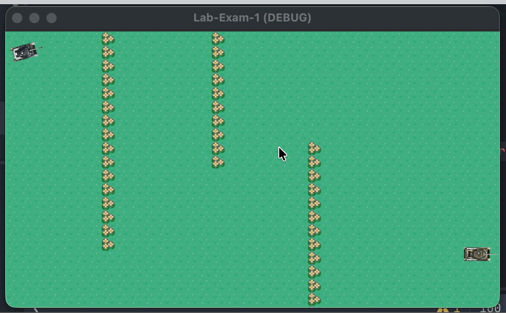
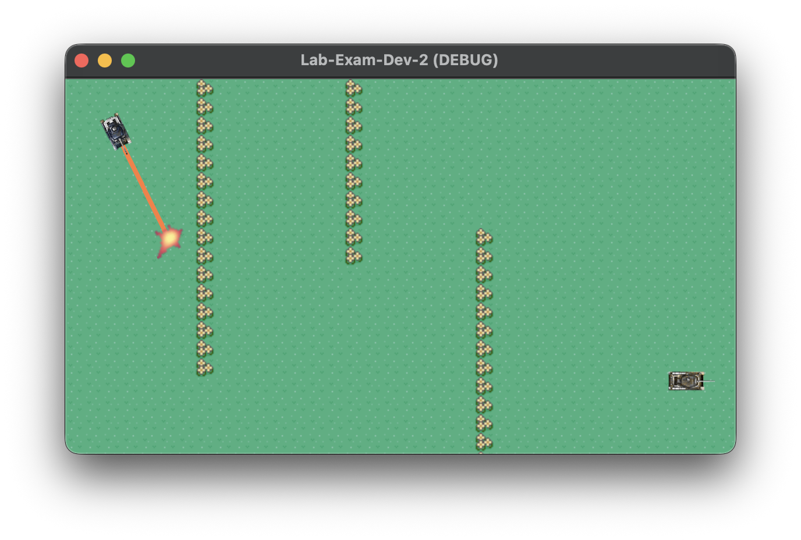
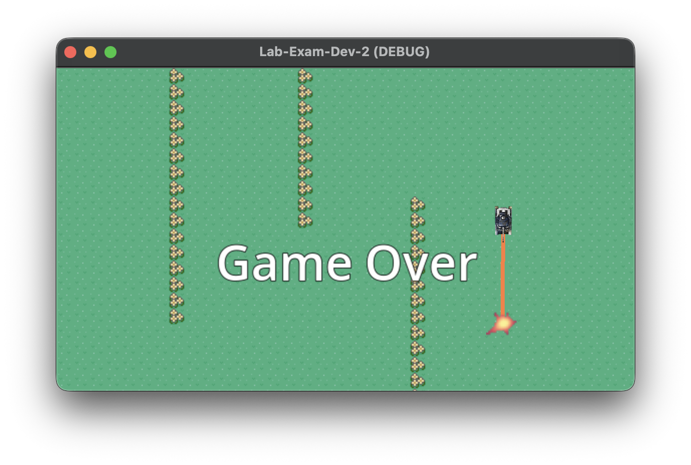

# CS2053 Lab Exam Practice - Feb 24, 4:15-4:55 PM

The steps in this lab have been arranged in suggested order of completion.

## Overview of the Lab Exam
Your goal is to create a simple 2D game. The game has a win (but no lose) condition, and is simply for you to demonstrate your ability in creating the basic elements of a game using Godot.

The Lab Exam is to be completed alone. You are free to use whatever resources you would like; however, AI or LLMs of any form are not permitted. You may use your previous labs to assist you. 

You must use the lab computers to complete this exam. Secondary devices are allowed to lookup other resources.

You have 40 minutes (4:15pm-4:55pm) during lab time to complete the exam and submit it by committing and pushing your solution. It would be best to allocate a small amount of time for submission.



## Requirements
You will build a simple game to have a player tank attack and destroy an enemy tank.

Partial points are available, so do your best to complete the steps where appropriate

**30 points total**

## Completed Game

Below is an image with all steps completed. Please note that this game is broken down in to multiple parts, and can be completed separately, and in different orders, and to different levels of completion.

The provided character.gd script should be read carefully, as it provides a partial solution and hints on how to complete rest of the lab.




1. (*2 points*) You have been provided a complete `player.tscn` scene. Move the player so they start in the top left corner. You should not need to edit the files or objects in this scene unless instructed in a later step.
	- You should be able to drive your player already. The mouse rotates the tank slowly as it follows your mouse cursor. The 'w' key moves the tank forward (it can only go forward). The mouse button will fire a shot. However, your tank cannot be turning when shooting, you must be looking straight ahead. Your tank will not allow you to drive off the screen.
2. (*8 points*) Recreate a game map that includes three distinct obstacle walls using a ```TileMapLayer```. You will have to us the provided `sheet.png` with your ```TileMapLayer```. Use one tile for the background. Use another tile that matches aesthetically for the obstacles (like the flowers). The tank should not 
2. (*8 points*) Using the `tank2.png` create an enemy character. The enemy will drive back and forth in a straight horizontal line. The tank should not exit the screen, or cross over any bariers. It is OK if you hardcode in values to keep the tank in the area. Your tank should have a ```CollisionShape2D``` that allows it to be shot by the Area2D explosion from the player's shot.
3. (*10 points*) Edit the Area2D script associated with the explosion. You can find this in the provided files: ```explosion.gd```. Update this script so that when the enemy is shot 3 times, it is destroyed (removed from the game); meaning the player has won. Add a ```Label``` to the game that clearly displays a "Game Over" message that is displayed only when the player wins the game.
4. (*2 points*) Pushing the 'r' key on the keyboard restarts the game (restarting could happen at any time, not just after winning).


 
 
 