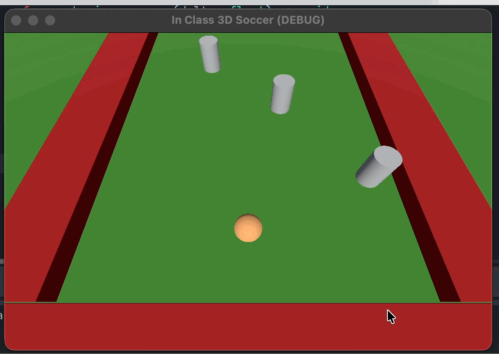
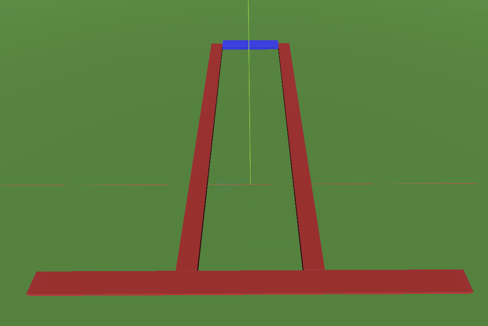
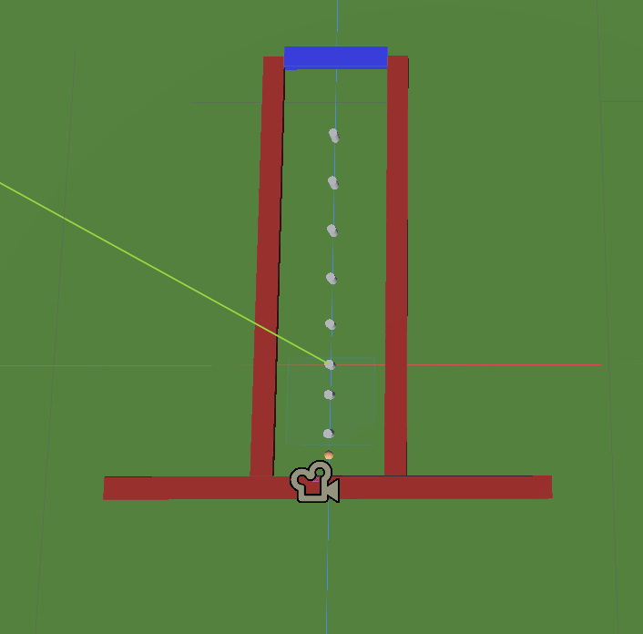

# CS2053 Lab Exam - March 24, 4:10-5:00 PM

The steps in this lab have been arranged in suggested order of completion.

## Overview of the Lab Exam
Your goal is to create a simple 3D game. 

The Lab Exam is to be completed alone. You are free to use whatever resources you would like; however, AI or LLMs of any form are not permitted. You may use your previous labs to assist you. 

You must use the lab computers to complete this exam. Secondary devices are allowed to lookup other resources.

You have 50 minutes (4:10pm-5:00pm) during lab time to complete the exam and submit it by committing and pushing your solution. It would be best to allocate a small amount of time for submission.



## Requirements
You will build a simple game to guide a ball through obstacles to reach a goal. If the player touches or is pushed into the red walls they win. If the player reaches the end of the course and touches the purple wall, they win.

Below are instructions on how to complete the game. Partial points are available, so do your best to complete the steps where appropriate.

Everything you need to complete the game is provided with the exception of the ball that you will guide through. The image below shows the provided level you have and will use. No changes are needed to this level.


### Detailed Steps - 30 points total

1. (**8 points**) Create a player ball with a radius of 1 meter that is controlled using forces, applied to the ball. The player ball should start towards in the course towards the end furthest from the purple goal wall.
2. (**2 points**) Add the provided spring follow camera, so it is place ideally to follow the player ball through the course. 
3. (**9 points**) Hitting the red wall causes the provided "Lose Label" to be made visible. Reaching the purple goal wall at the end causes the "Win Label" to be made visible. *See hints below*. 
4. (**3 points**) After winning or losing the ball can no longer be controlled. 
5. (**3 points**) If the ball continues moving and hits a wall after winning or the goal after losing, the message should not change.
6. (**2 points**) Pushing the 'r' key on the keyboard restarts the game (restarting could happen at any time, not just after winning or losing). 
7. (**3 points**) Add at least 8 of the provided obstacles spread out evenly throughout the level. Ensure that the obstacles are placed so that they do not touch the red walls. The the obstacle script should not need to be editted in anyway. *See the image below.*

### Hints

- Note that the red walls are part of the "wall" group. And the goal (purple wall) is part of the "goal" group.

- You can use ```body.is_in_group("wall")``` to test to see if your player ball is colliding with the wall group.
 


