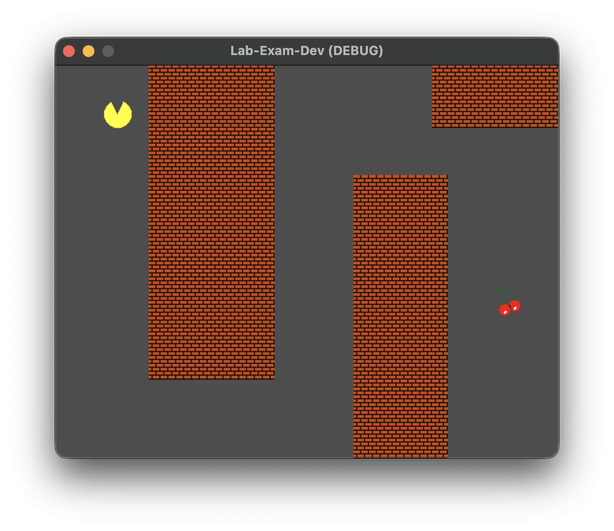
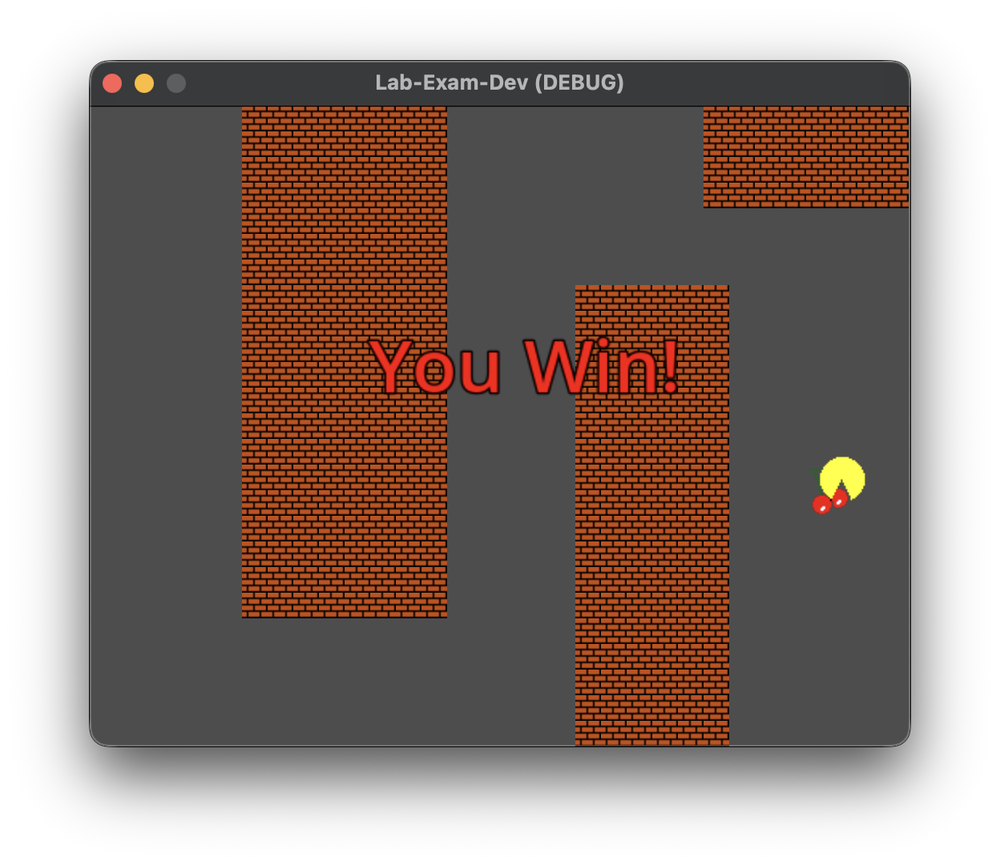

# CS2053 Lab Exam Practice - Feb 17, 4:15-4:45 PM

The steps in this lab have been arranged in suggested order of completion.

## Overview of the Lab Exam
Your goal is to create a simple 2D game. The game has a win (but no lose) condition, and is simply for you to demonstrate your ability in creating the basic elements of a game using Godot.

The Lab Exam is to be completed alone. You are free to use whatever resources you would like; however, AI or LLMs of any form are not permitted. You may use your previous labs to assist you. 

You have 30 minutes (4:15pm-4:45pm) during lab time to complete the exam and submit it by committing and pushing your solution. It would be best to allocate a small amount of time for submission.

## Requirements
You will build a simple game to guide pacman to the goal.

Partial points are available, so do your best to complete the steps where appropriate

**24 points total**

## Completed Game

Below is an image with all steps completed. Please note that this game is broken down in to multiple parts, and can be completed separately, and in different orders, and to different levels of completion.

The provided character.gd script should be read carefully, as it provides a partial solution and hints on how to complete rest of the lab.



1. (*3 points*) Recreate a game map that includes three distinct obstacle walls in the provided ```TileMapLayer```. The tiles already have colliders added to them, so you should not have to worry about adding them. The map does not need to be exactly like the image above, but should have the same general path. The bricks that have been set up are Atlas coordinates (2,4); just mouse over the tiles in the TileMap to see their coordinates. 
2. (*9 points*) A character scene has already been provided. Add the character to the main scene, and place it in the top left of the screen. Complete the character script, so that the character moves (up, down, left, right) using the arrows, and at the provided speed. When the arrow is pressed the appropriate animation is played. The character should fully remain on the screen at all times (i.e., it cannot leave the edges). 
3. (*9 points*) Create a goal "using the cherry" that when the player reaches it, the game ends, and the "You Win!" message is displayed. 
4. (*3 points*) After winning, the player should not move any more and the game stops responding. Pushing the 'r' key on the keyboard restarts the game (restarting could happen at any time, not just after winning).


 
 
 